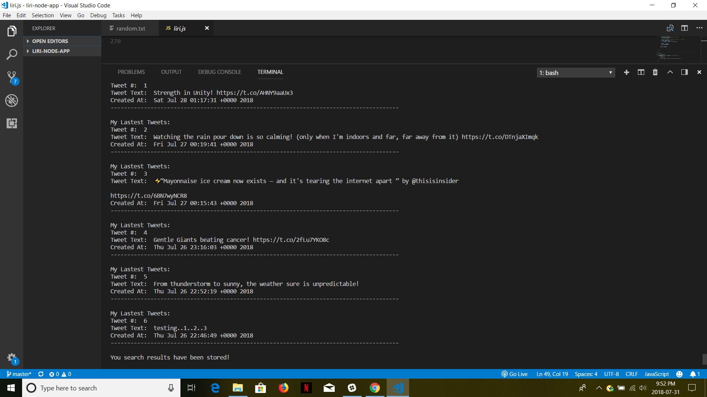

## Introduction

LIRI (Language Interpretation and Recognition Interface) is a Node.js app designed to be run on the command line. LIRI takes in commands and outputs data from the Twitter, OMDB, and Spotify APIs.

* Liri.js takes in the following commands:
 1. `my-tweets`
 2. `spotify-this-song`
 3. `movie-this`
 4. `do-what-it-says`
 
 * Refer below for an example of each command and its output
 
```
node liri.js my-tweets
```
 * Sample Output (Please note, I don't have 20 tweets on my account, which was created for trial purposes only)
 
 
 
 
 
 

