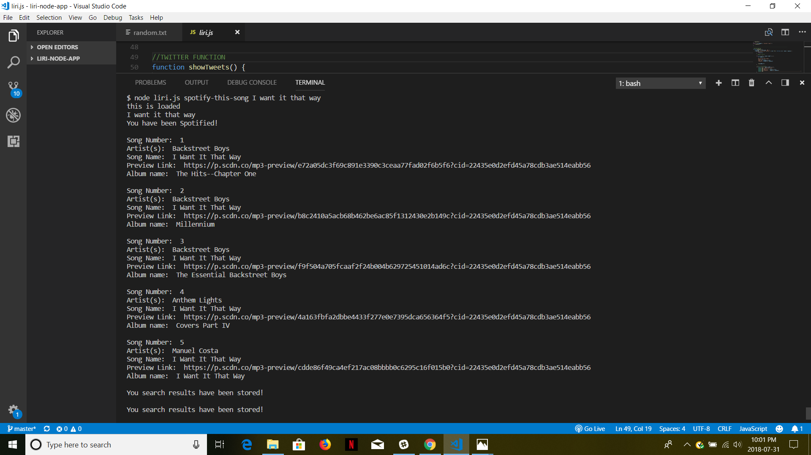
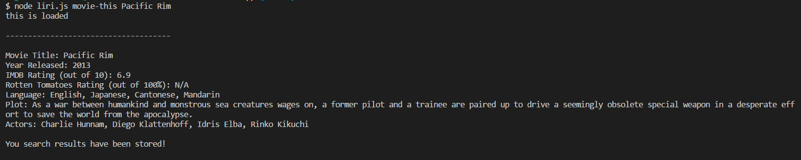

## Introduction

LIRI (Language Interpretation and Recognition Interface) is a Node.js app designed to be run on the command line. LIRI takes in commands and outputs data from the Twitter, OMDB, and Spotify APIs.

* Liri.js takes in the following commands:
 1. `my-tweets`
 2. `spotify-this-song`
 3. `movie-this`
 4. `do-what-it-says`
 
 * Refer below for an example of each command and its output
 
 A.
 
```
node liri.js my-tweets
```
  Sample Output (Please note, I don't have 20 tweets on my account, which was created for trial purposes only)
 
 
 
 
 B.
 
```
node liri.js spotify-this-song '<song name here>'
```
 Sample Output (Song limit has been set to 5)

 
 
 
 C.
 
```
node liri.js movie-this '<movie name here>'
```
 Sample Output
 
 
 
 D.
 
 ```
node liri.js do-what-it-says
```
 Takes commands from random.txt file and uses it call one of LIRI's commands.
 
 
 
 
 ---------------------------------------------------------------------------------------------------------------------------------------
 
 
 
 * NPM Packages used to build this app
 1. fs package in node
	2. [twitter](https://www.npmjs.com/package/twitter)
	3. [spotify](https://www.npmjs.com/package/spotify)
	4. [request](https://www.npmjs.com/package/request)
 
 For more packages, please refer to https://www.npmjs.com, and search for packages
 
 
 
 * Please run these commands in your terminal (one at a time) to install these packages
```
npm install twitter
npm install spotify
npm install request
```
 
 
 ## Copyright
 Apbh (2018). All Rights Reserved

